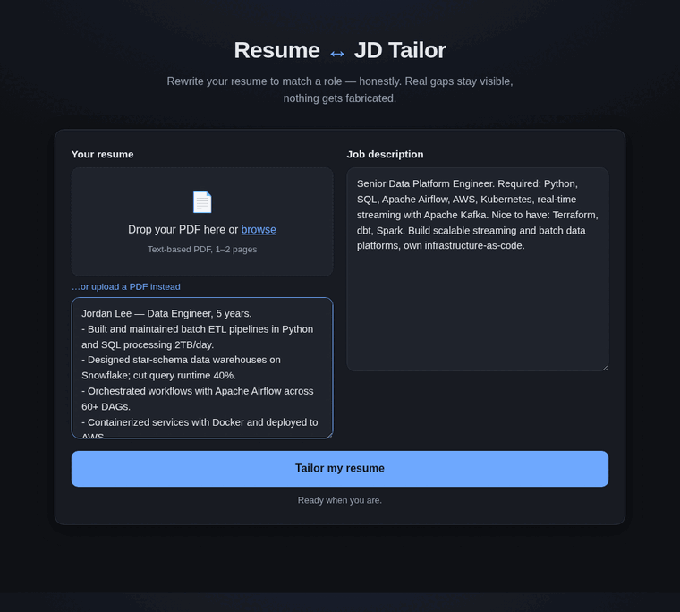
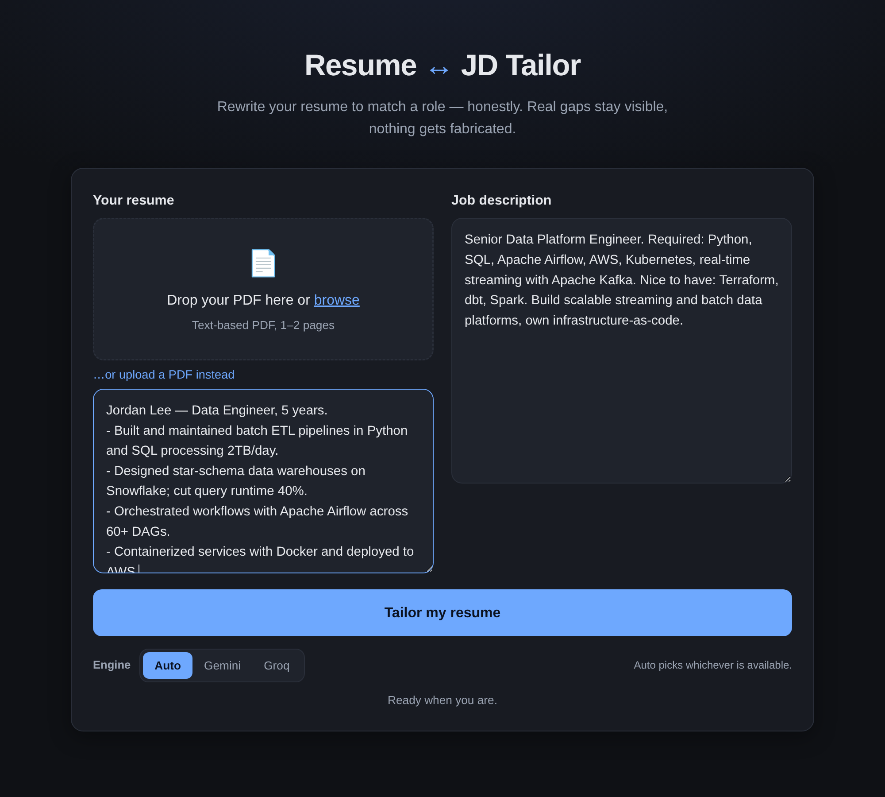
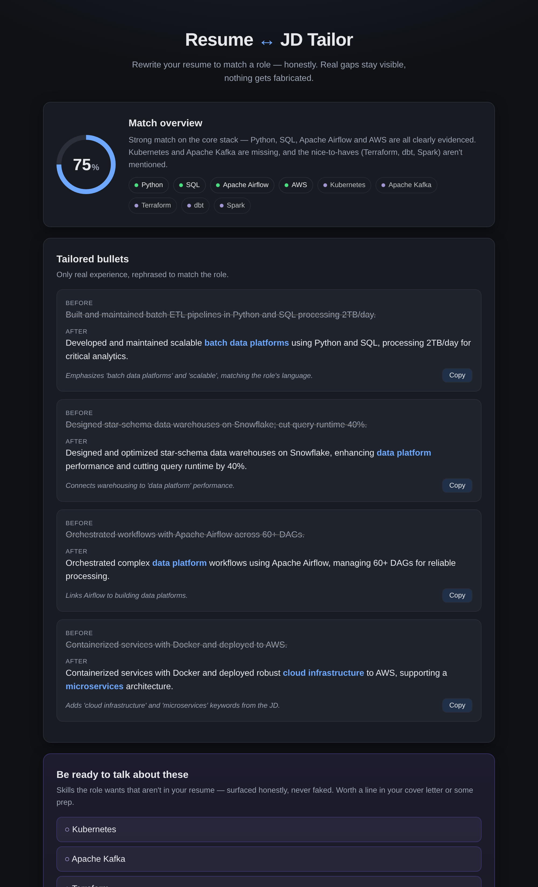
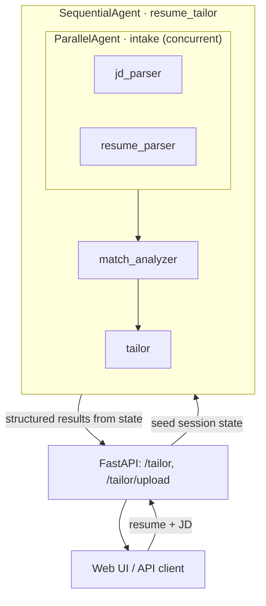
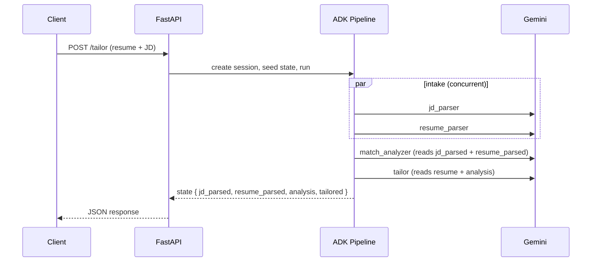

# Resume ↔ JD Tailor

A multi-agent web service that compares a resume against a job description,
scores the fit skill-by-skill, and rewrites the resume's bullet points to align
with the role — **without fabricating experience the candidate doesn't have.**

Skills the candidate genuinely lacks are never invented into bullets; they are
surfaced separately as *honest gaps*. That guarantee is the core design
constraint of the whole system, and it is enforced by an automated evaluation
harness.

**Stack:** Python · [Google ADK](https://google.github.io/adk-docs/) (Agent
Development Kit) · FastAPI · Pydantic · `pypdf` · vanilla JS frontend.

**🔗 Live demo:** <https://huggingface.co/spaces/Sharath32/resume-jd-tailor>
<sub>(Hosted on a free tier — the underlying model key is rate-limited, so a live
run may occasionally need a retry.)</sub>

---

## Demo



> A data-engineer résumé tailored to a senior data-platform role: the pipeline
> scores the fit, rewrites bullets to match the JD's language, and lists the
> skills it **refused to fabricate** (Kubernetes, Kafka, Terraform…) as honest
> gaps instead of inventing them.

<details><summary><b>Screenshots</b></summary>

| Input | Results |
| --- | --- |
|  |  |

</details>

---

## Contents

- [Demo](#demo)
- [Features](#features)
- [Architecture](#architecture)
- [Request lifecycle](#request-lifecycle)
- [Why it's built this way](#why-its-built-this-way)
- [API](#api)
- [Web UI](#web-ui)
- [Deployment](#deployment)
- [Getting started](#getting-started)
- [Evaluation](#evaluation)
- [Project structure](#project-structure)
- [Roadmap](#roadmap)

---

## Features

- **Four-stage agent pipeline** — parse JD → parse resume → analyze fit → tailor,
  composed from ADK's `SequentialAgent` and `ParallelAgent` primitives.
- **Schema-enforced hand-offs** — every agent emits validated JSON via a Pydantic
  `output_schema`, so downstream stages consume structured data, never free text.
- **No-fabrication guardrail** — the tailoring agent may only rephrase real
  experience; missing requirements are routed to an `honest_gaps` list. Enforced
  by a *fabrication tripwire* in the eval that must stay at zero.
- **Cost-aware model routing** — cheap model for structured extraction, stronger
  model only for the creative rewrite step.
- **Two ways in** — a JSON API for machines, and a single-page web UI that accepts
  a **PDF upload** (text extracted server-side) or pasted text.
- **Defensive input handling** — PDF magic-byte sniffing, an upload size cap, and
  a low-text guardrail that rejects scanned/image PDFs *before* any model call,
  so garbage never reaches the analysis.

## Architecture

The system is a single FastAPI process that hosts both the HTTP API and the
static web UI, fronting a Google ADK agent pipeline.



```
SequentialAgent (resume_tailor)
├── ParallelAgent (intake)
│   ├── jd_parser        → state["jd_parsed"]      (flash-lite)
│   └── resume_parser    → state["resume_parsed"]  (flash-lite)
├── match_analyzer       → state["analysis"]       (flash-lite)
└── tailor               → state["tailored"]       (flash)
```

Four LLM agents composed under two orchestration agents. The JD and resume
parsers are independent, so they run **concurrently** inside a `ParallelAgent`;
everything after is **sequential** because each stage depends on the previous
one's output.

## Request lifecycle

The pipeline has *two* inputs (resume + JD). Rather than concatenating them into
one prompt, they're seeded into **session state** at session creation. Each agent
pulls exactly the slice it needs via `{placeholder}` templating in its
instruction and writes its result back under a named `output_key`. When the run
finishes, the API reads the four structured results out of state.



State evolves like this:

```
start:           { resume, job_description }
after intake:    { …, jd_parsed, resume_parsed }
after analyzer:  { …, analysis }
after tailor:    { …, tailored }
```

For a PDF upload, `/tailor/upload` extracts text with `pypdf` (rejecting
unreadable/scanned files up front) and then runs the **same** pipeline — the
JSON `/tailor` contract is never touched.

## Why it's built this way

| Decision | Rationale |
| --- | --- |
| **State-passing, not prompt-stuffing** | Two inputs are seeded into session state and read via `{placeholder}` templating, keeping each agent's prompt focused and the data flow explicit. |
| **`output_schema` on every agent** | Forces enforced JSON (Pydantic) instead of prose, so matching/analysis run on machine-readable data and downstream agents have a stable contract. |
| **Per-agent model routing** | Parsers and analyzer do mechanical extraction on the cheaper `gemini-2.5-flash-lite`; only the creative rewrite uses `gemini-2.5-flash`. Quality where it matters, cost control everywhere else. |
| **No-fabrication as a hard constraint** | The tailoring prompt forbids inventing skills and routes missing ones to `honest_gaps`; the eval's tripwire fails the build if a fabricated skill ever appears in a tailored bullet. |
| **PDF guardrail before the model** | A low-text / encrypted / non-PDF check rejects bad input early, so the no-fabrication guarantee can't be undermined by garbage extraction. |

## API

Interactive Swagger docs are served at **`/docs`**.

### `POST /tailor` — JSON

```json
{
  "resume_text": "plain text of your resume",
  "job_description": "plain text of the job description",
  "user_id": "demo-user"
}
```

### `POST /tailor/upload` — multipart

| Field | Type | Notes |
| --- | --- | --- |
| `resume_pdf` | file | A text-based PDF. Validated by magic bytes; 10 MB cap. |
| `job_description` | form text | The JD as plain text. |

Rejects with `415` (not a PDF), `413` (too large), or `422` (scanned/empty/
password-protected — "paste the text instead") *before* any model call.

### Response (both endpoints)

A single JSON object with four sections:

| Field | Contents |
| --- | --- |
| `jd_parsed` | title, seniority, required / nice-to-have skills, responsibilities, ATS keywords |
| `resume_parsed` | skills, technologies, verbatim experience bullets, years of experience |
| `analysis` | `match_score` (0–100), per-skill `covered` / `partial` / `missing` + evidence, summary |
| `tailored` | rewritten bullets (`original` + `tailored` + `rationale`), `ats_keywords_to_add`, `honest_gaps` |

```bash
curl -X POST http://localhost:8000/tailor \
  -H "Content-Type: application/json" \
  -d '{
    "resume_text": "Backend engineer. Built REST APIs in Python with FastAPI...",
    "job_description": "Senior Backend Engineer. Required: Python, FastAPI, Kubernetes..."
  }'
```

### `GET /health`

Liveness probe → `{"status": "ok"}`.

## Web UI

A dependency-free single page (`static/`) served by the same app at `/`:

- Drag-and-drop **PDF upload** with a paste-text fallback, plus a JD textarea.
- A staged progress indicator narrating the four pipeline steps during the wait.
- A results view that frames the **match score** as a starting point (never a red
  "fail"), shows each bullet as an **original → tailored diff** with copy buttons,
  and gives `honest_gaps` its own clearly-labelled panel — the integrity feature
  is front and center, not hidden.

## Deployment

The app is containerized, so it runs on any container host:

```bash
docker build -t resume-jd-tailor .
docker run -p 7860:7860 --env-file .env resume-jd-tailor   # → http://localhost:7860
```

- **Hugging Face Spaces** (free): create a *Docker* Space, push this repo, and add
  `GOOGLE_API_KEY` + `GOOGLE_GENAI_USE_VERTEXAI=FALSE` as Space secrets. The
  container listens on `7860` (the Spaces default).
- **Google Cloud Run** (free tier, scales to zero):
  ```bash
  gcloud run deploy resume-jd-tailor --source . \
    --set-env-vars GOOGLE_GENAI_USE_VERTEXAI=FALSE \
    --set-secrets GOOGLE_API_KEY=GOOGLE_API_KEY:latest \
    --allow-unauthenticated
  ```

> The pipeline makes several model calls per request, so a public demo on a
> free API key can hit rate limits. For real traffic, enable billing on the key
> or route to another provider via ADK's LiteLLM support.

## Getting started

```bash
python -m venv .venv && source .venv/bin/activate   # Windows: .venv\Scripts\activate
pip install -r requirements.txt
cp .env.example .env       # then add your Google AI Studio API key
```

Get a free key at <https://aistudio.google.com>. Set `GOOGLE_API_KEY` and
`GOOGLE_GENAI_USE_VERTEXAI=FALSE` in `.env`.

```bash
uvicorn main:app --reload
```

- Web UI → <http://localhost:8000/>
- API docs → <http://localhost:8000/docs>

A `Makefile` wraps the common commands: `make install`, `make run`, `make eval`.

## Evaluation

```bash
python eval.py
```

Runs the pipeline over a labeled set of `(resume, JD)` pairs and reports three
numbers:

- **Covered recall** — did the analyzer recognize skills the candidate has?
- **Missing recall** — did it correctly flag skills the candidate lacks?
- **Fabrication failures** — how often a tailored bullet claimed a skill the
  candidate doesn't have. **This must be 0** and is the project's acceptance gate.

## Project structure

```
resume-tailor/
├── agents.py        # ADK agents + orchestration (the multi-agent core)
├── schemas.py       # Pydantic models used as ADK output_schema
├── main.py          # FastAPI app, endpoints, run_pipeline()
├── pdf_utils.py     # PDF text extraction + input guardrails
├── eval.py          # evaluation harness (fabrication tripwire)
├── eval_data.py     # labeled (resume, JD) test cases
├── static/          # single-page web UI (HTML/CSS/JS)
├── docs/            # README media (demo GIF + screenshots)
├── Dockerfile       # portable image (Hugging Face Spaces / Cloud Run)
├── requirements.txt
├── Makefile
└── .env.example
```

## Roadmap

- Stream live per-agent progress to the UI (surface the ADK pipeline events).
- JD-from-URL: fetch and strip a job posting server-side.
- Embedding-based similarity as an alternative to the LLM skill matcher.
- LLM-as-judge scoring for tailored-bullet quality.
- Persist sessions (swap `InMemorySessionService` for a database-backed store).
```
